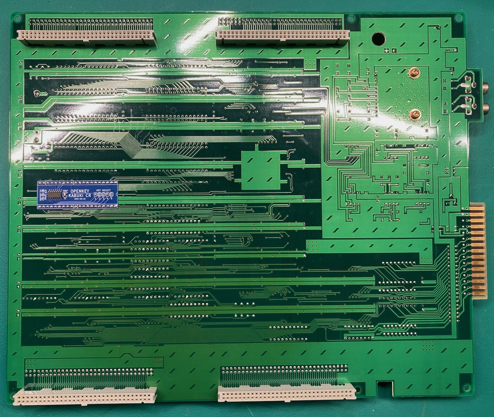
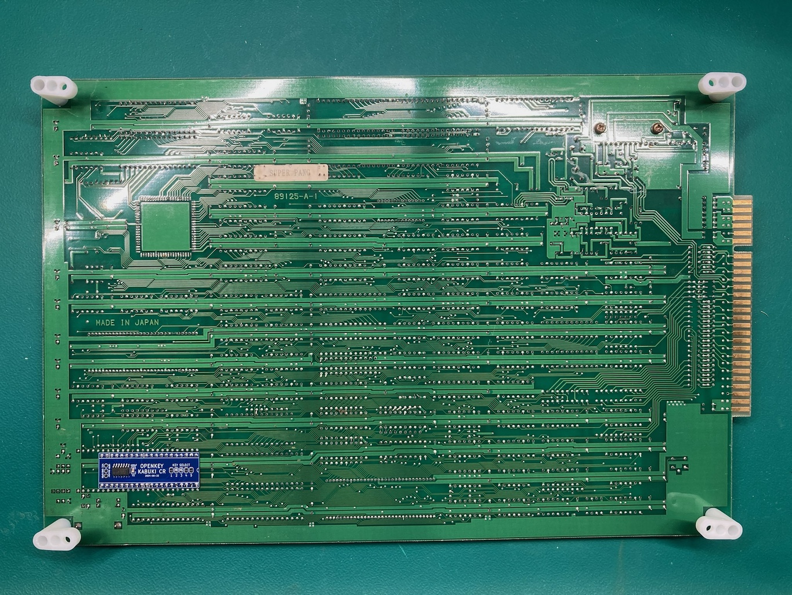

# openkey-kabuki-cr

  * [Overview](#overview)
  * [Project Status](#project-status)
  * [Support Games](#support-games)
      - [Mitchell](#mitchell)
      - [CPS 1.5 (QSound CPU)](#cps-15--qsound-cpu-)
  * [Hardware](#hardware)
      - [PCB Manufacturing](#pcb-manufacturing)
      - [BOM](#bom)
      - [Assembly](#assembly)
  * [Programming](#programming)
      - [Hardware](#hardware-1)
      - [Software](#software)
  * [Dead Battery Society Removal](#dead-battery-society-removal)
      - [Mitchell DBS Identify/Removal](#mitchell-dbs-identify-removal)
      - [CPS 1.5 (QSound CPU) DBS Identify/Removal](#cps-15--qsound-cpu--dbs-identify-removal)
  * [Installation](#installation)

## Overview
This is an alternate version of the original [openkey kabubki](https://github.com/jwestfall69/openkey-kabuki).  One thing I never really liked about the original is it felt like it was always at risk of popping out of the cpu socket.  This alternate version goes on the underside of the arcade PCB by soldering to the pins of the CPU socket.

I wasn't sure what to call this version, but decided on 'openkey kabuki CR'. CR standing for cost reduced.  While the lower cost is not why I made this version, the BOM does go from ~$5 down to ~$0.60.  

Installed (cps 1.5 D board): 

This project is providing the same functionality as [Undamned's InfiniKey-Kabuki](https://www.arcade-projects.com/threads/infinikey-kabuki.8338/).  The lack of supply is what prompted me to make openkey-kabuki.  If they ever end up coming back in stock please consider purchasing those to support [Undamned](https://www.arcade-projects.com/forums/temple-of-the-undamned.77/)'s work.

Details on *how* to program a kabuki CPU's key data can be found in [Eduardo Cruz](http://arcadehacker.blogspot.com/)'s [write up](http://arcadehacker.blogspot.com/2014/11/capcom-kabuki-cpu-intro.html) and [youtube video](https://www.youtube.com/watch?v=9t-9hQEOjLI).

Details on *what* to program can be found in MAME's decryption code for the [kabuki CPU](https://github.com/mamedev/mame/blob/master/src/mame/capcom/kabuki.cpp#L73).

## Project Status
**PCB:** I would consider the design PCB done at this point.  I'm open to any input on changes/improvements.

**Firmware:** Need to get untested games tested

**Documentation:** Done

## Support Games
Openkey Kabuki CR uses solder jumpers for picking the game key.

Below is a list of supported games and what jumpers must be used for each.  This list/table is the same as the original openkey kabuki.

#### Mitchell
| Jumper 12345 | Program ROM Labels | MAME Sets | Game Names | Tested / Working |
|-----------------|:------------------:|-----------|--------------|:-----------------:|
| 00000 | BLE BLJ | block blockj | Block Block | YES (conversion)|
| 00001 | CBJ | cbasebal | Capcom Baseball | |
| 00010 | CW | cworld | Capcom World | YES (conversion) |
| 00011 | D2 | dokaben2 | Dokaben 2 | YES (conversion) |
| 00100 | DB | dokaben | Dokaben | YES (conversion) |
| 00101 | MG2 | mgakuen2 | Mahjong Gakuen 2 Gakuen-chou no Fukushuu | YES |
| 00110 | MG3 | marukin | Super Marukin-Ban | YES (conversion) |
| 00111 | PK PKO | pkladiesl pkladies | Poker Ladies | YES (conversion) |
| 01000 | PWE PWJ PWU | pang pompingw bbros | Pang Pomping World Buster Bros | YES |
| 01001 | Q2 | hatena | Adventure Quiz 2 - Hatena? no Daibouken | YES (conversion) |
| 01010 | Q3 | qtono1 | Quiz Tonosama no Yabou | YES |
| 01011 | Q4 | qsangoku | Quiz Sangokushi | YES |
| 01100 | SPE | spang | Super Pang (World) | YES |
| 01101 | SPJ | spangj | Super Pang (Japan) | YES |
| 01110 | SPU | sbbros | Super Buster Bros | YES |
| 01111 | ??? | ??? | Ashita Tenki ni Naare  (place holder) | |

#### CPS 1.5 (QSound CPU)
| Jumper 12345 | Program ROM Labels | MAME Sets | Game Names | Tested / Working |
|-----------------|:------------------:|-----------|--------------|:-----------------:|
| 10000 | CDE CDJ CDT CDU | dino dinoj dinoa dinou | Cadillacs and Dinosaurs | |
| 10001 | MBE MBJ MBU MBDE MBDJ | slammast mbomberj slammastu mbombrd mbombrdj | Saturday Night Slam Masters Muscle Bomber Muscle Bomber Duo | YES |
| 10010 | PSE PSH PSJ PSE | punisher punisherh punisherj punisheru | Punisher | YES |
| 10011 | TK2A TK2E TK2J TK2U | wofa wof wofj wofu | Warriors of Fate | YES |

**IMPORTANT**: There is a compatibility issue with the older 92636D-3 revision of the D board.  Specifics on this issue can be found [here](https://www.arcade-projects.com/threads/openkey-kabuki-project.23571/post-370690)

When openkey-kabuki is used on a 92636D-3 board revision you will get:

  * "RAM ERROR" screen on Warriors of Fate
  * "1111 EXCEPTION" screen on Slam Masters
  * "NG" screen on Muscle Bomber Duo
  * A black screen on Punisher and C&D

Thus far I've only seen WOF using this older version of the D board.

The compatibility issue was tracked down to a bug in the D9K1 PAL thats on 92636D-3.  The fix is to upgrade that PAL to D9K2, which is found on the newer revision of the D board (92636D-5).

## Hardware
---
#### PCB Manufacturing
For board thickness the default of 1.6mm is probably fine, but for my first run of the boards I used 1.0mm.  This is slim enough that the CPU socket pins stick a little bit above the openkey kabuki CR board..

I've been using [jlcpcb](https://jlcpcb.com/) for PCB manufacturing.  

#### BOM
| Description | Part Number | DigiKey | Mouser | Notes |
|-------------|-------------|---------|--------|-------|
| ATtiny404 20Mhz | ATTINY404-SSN | [ATTINY404-SSN-ND](https://www.digikey.com/en/products/detail/microchip-technology/ATTINY404-SSN/9947546) | [556-ATTINY404-SSNR](https://www.mouser.com/ProductDetail/Microchip-Technology-Atmel/ATTINY404-SSNR?qs=F5EMLAvA7IAEqD7Aw0z%252B9Q%3D%3D) | Other ATtiny tinyAVR 0/1/2-series models should be viable as well.  The code compiles to just over 1K in size, so any that have 2k or more of flash should work.  Just note I have only tested with 404s |
| 100nf / 0.1uf SMD Ceramic Capacitor 0805 Size | | | | |

**NOTE**: Additional components maybe needed if you need to revert any previously made desuicide modifications to the arcade PCB.  Check the Dead Battery Society Removal section at the bottom for details.

#### Assembly
Nothing special here, just solder the ATtiny404 and bypass capacitor to the board.  You can also solder the jumpers at this point as they won't interfere with programming like they do on openkey-cps2.

## Programming
**IMPORTANT:** Programming should be done before soldering the openkey to the arcade PCB.

#### Hardware
Programming is done with a UPDI programmer.  I've been using this one:

[Serial UPDI Programmer for ATmega 0-Series, or ATtiny 0-Series or 1-Series, or AVR DA or AVR DB](https://www.amazon.com/dp/B09X64YRLD?psc=1&ref=ppx_yo2ov_dt_b_product_details)

Note: This programmer (and likely others) has a switch for 3.3V and 5V.  Set it to 5V.

The openkey kabuki CR programming port consists of 3x pads (VCC, GND, UPDI) that will need to be connected to the programmer.  I've been using a short 3 pin female to female IDC cable with [pogo pins](https://www.amazon.com/dp/B00X7C8PGE?psc=1&ref=ppx_yo2ov_dt_b_product_details) on one end to do this.  Additionally you could probably use something like [this](https://www.amazon.com/dp/B09MGG4C6X?ref=ppx_yo2ov_dt_b_product_details&th=1) if you are going to be programming a bunch.

Of course be sure you properly orient the board so the labeled pads match up.  vcc to vcc, gnd to gnd, and updi to updi.

#### Software
For software I've been using the [Arduino IDE](https://www.arduino.cc/en/software/OldSoftwareReleases) with [megaTinyCore](https://github.com/SpenceKonde/megaTinyCore), which adds support for tinyAVR 0/1/2-Series MCUs.

**NOTE**: The makers of megaTinyCore currently recommend using Arduino IDE version 1.8.13 for best compatibility.  2.0 definitely does not work!

To install the megaTinyCore you, should just need to add http://drazzy.com/package_drazzy.com_index.json to "Additional Boards Manager URLs" in the settings for the Arduino IDE.

From there you need to configure the board/programming settings.  I've been using these:

**IMPORTANT:** The firmware between the original openkey kabuki and the CR version is different, make sure you are using the CR version.

## Dead Battery Society Removal
Prior to installing openkey kabuki CR you should verify you don't have the [The Dead Battery Society](http://www.arcadecollecting.com/dead/) mod installed on your mitchell or cps 1.5 D board.  Part of the DBS mod is to tie pin 28 of the kabuki CPU to GND.  This pin is normally fed voltage from the battery/vcc to supply the CPU with power for its internal ram holding the key data.  openkey-kabuki will not function unless this is reverted.

Below is how you can identify if the DBS mod is been installed and how to remove it.

#### Mitchell DBS Identify/Removal
This is what a dead battery society mod will look like

 * R33 (1k ohm resistor) is missing
 * Right through hole of R33 is bridged to the lower right
 * Those pins on the program roms are soldered together and have a wire from them to a pin on the cpu
 * Modified program roms

 All of these things will need to be reverted in order to use openkey-kabuki.  This is what an unmodified board should look like.

 

#### CPS 1.5 (QSound CPU) DBS Identify/Removal

This is what the dead battery society mod will look like on the QSound board of a cps 1.5 game.

Top Side: 

* R33 (1 ohm resistor 0805 size) is missing
* C12 (100nf capacitor 0805 size) is replaced with a jumper
* Modified QSound program rom

Bottom Side: 

* Wire running from QSound program rom pin 30 to Kabuki CPU pin 27
* Cut trace between QSound program rom pins 30 and 31

There will be additional changes specific to slam masters / muscle bomber which are not covered above.

Once reverted it should look like this

Top Side: 

Bottom Side: 

Its hard to tell from the picture, but pins 30 and 31 on the QSound program rom are jumper'd together.

## Installation
openkey kabuki CR gets soldered to the underside of the kabuki CPU socket.  There are a couple things to do before soldering.

* Straighten any CPU socket pins that are bent
* Clean any oxidation or corrosion off the CPU socket pins

The openkey kabuki CR board should be oriented so the notch in the silk screen (near #5 in the key select) is facing the same direction as the notch on the CPU/socket on the top side of the arcade PCB.  In theory it should be towards the jamma edge as well.

Only a handful of pins need to be soldered for openkey kabuki CR to be functional, as seen below.

Its advised you initially only solder these pins, then test.  If there ends up being an issue, it will be a lot less work to desolder 8 pins then 40.

Once it tests ok, go ahead and solder the rest of the pins.

Below are example installations

Pang/Super Pang Style Boards: 

CPS 1.5 D Board: 

Block Block / Poker Ladies / Quiz Style Boards: 

Mahjong Style Boards: 
